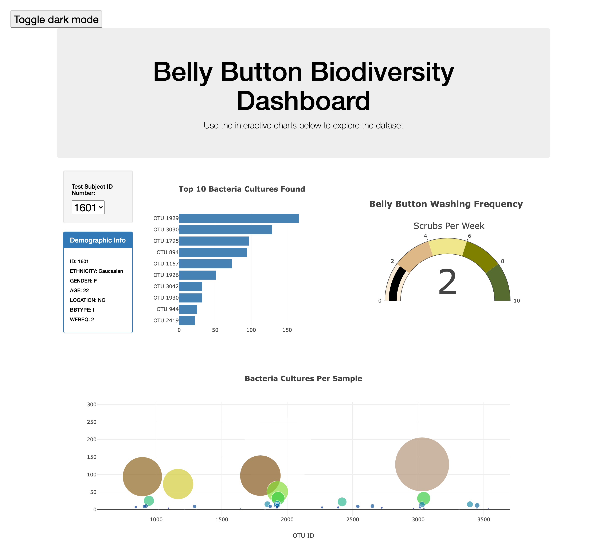

# BBiodiversity

## Overview
The purpose of this project is to create an interactive dashboard that explores data from a dataset. The dataset contains raw data from a research study of the bacteria found in belly butoons. The visualization sorts the data by test subject id number.

- The vertical bar chart indicates and ranks the bacteria cultures found.
- The gauge chart represents the weekly frequency of belly button washing.
- The bubble chart shows the amount of cultures in each sample.